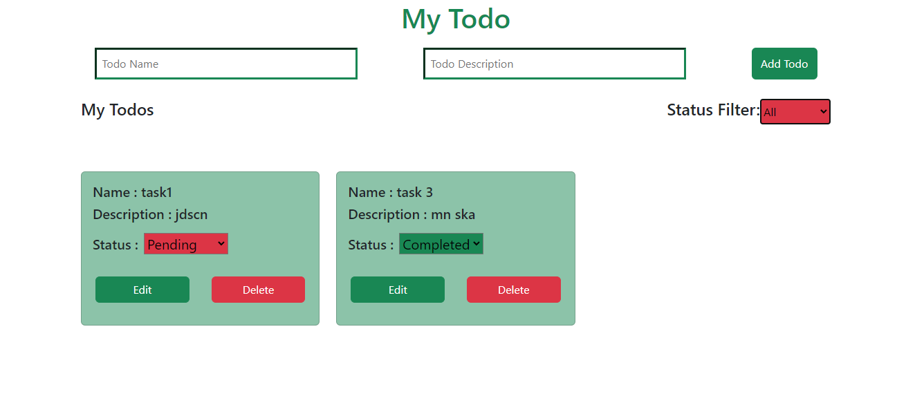

# React + Vite
 - Todo application build in HTML+CSS+Bootstrap+React.js

 
 
 - Todo Application features are

```
 - Creating          -->new todo list
 - Filtering         -->based on completed or pending either all option
 - Status Updation   -->denoting todo status
 - Delete todo       -->delete particular todo
 - Edit updation     -->title of todo and descriptioin
```
 - Application contain components are
 ```
 - App
 - TodoInput.jsx
 - TodoMenuBar.jsx
 - TodoDispkay.jsx
 
 ```
- State management  and `side Effect-useEffect()`
 ```
  - useState() and useEffect()
 ```

 - File path tree
 ```
+----_src
      +--assets
      +--_components
         +--css
         +-- TodoInput.jsx
         +-- TodoMenuBar.jsx
         +-- TodoDispkay.jsx
      +--App.css
      +--App.jsx
      +--index.css
      +--main.jsx
+--.gitignore
+--index.html
+--package-lock.json
+--package.json
+--README.md
+--vite.config.js
 ```
This template provides a minimal setup to get React working in Vite with HMR and some ESLint rules.

Currently, two official plugins are available:

- [@vitejs/plugin-react](https://github.com/vitejs/vite-plugin-react/blob/main/packages/plugin-react/README.md) uses [Babel](https://babeljs.io/) for Fast Refresh
- [@vitejs/plugin-react-swc](https://github.com/vitejs/vite-plugin-react-swc) uses [SWC](https://swc.rs/) for Fast Refresh
